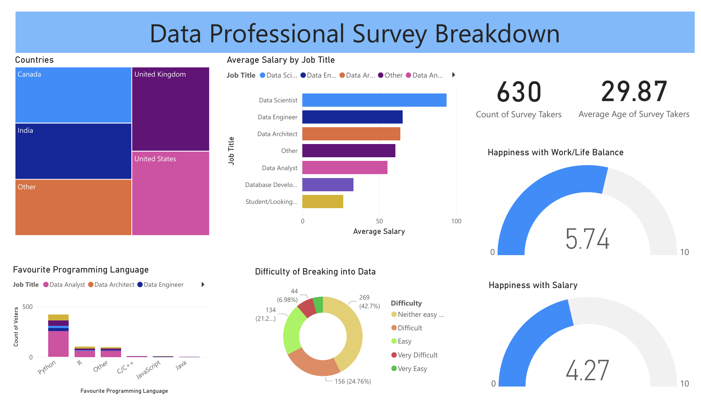

# Data Professional Survey: Interactive Power BI Dashboard

### Project Overview

This project transforms raw survey data from over 600 data professionals into an interactive Power BI dashboard. The goal was to visualise the current state of the data industry, focusing on salary trends, job satisfaction, and the most popular programming languages across different job roles.

### Dashboard Preview

Above: A preview of the interactive dashboard showing global survey results.

### The Analysis

The dashboard provides a high-level view of the data profession, answering key questions such as:

- What is the average salary for a Data Analyst vs a Data Scientist?

- Which languages (Python, R, SQL) are most dominant in the field?

- How does job satisfaction vary by job title and remote work status?

- A breakdown of the global reach of the data professional community.

### How to View

Data Professional Survey.pbix: Download this file to explore the full interactivity and DAX logic in Power BI Desktop.

Screenshots: See the Images/ folder in this repository for static views of the main dashboard pages.
